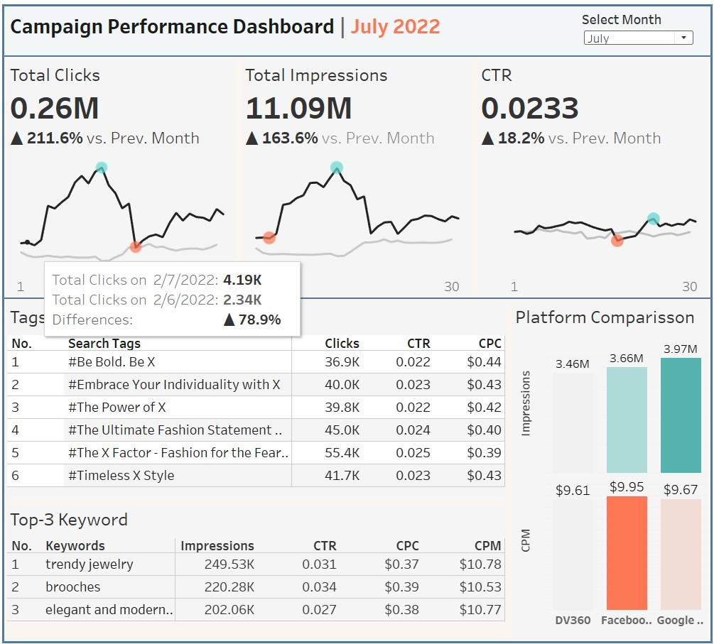

# ABCJewelryCampaignPerformanceDashboard
Dataset: You can download [here](https://www.kaggle.com/datasets/rahulchavan99/marketing-campaign-dataset).\
Dashboard: The dashboard is available [here](https://public.tableau.com/app/profile/muh.nurfaizy/viz/CampaignPerformanceDashboard2/Dashboard2).

## Dashboard Overview

### Insight
1. Significant Increase in Clicks and Impressions. In July 2022, there was a 211.6% increase in clicks and a 163.6% rise in impressions compared to June. This indicates that the campaign successfully expanded its audience reach and boosted engagement. The Click-Through Rate (CTR) also saw a slight improvement, from 0.020 in June to 0.023 in July, suggesting that content relevance was maintained despite the broader reach.
2. Shifting Platform Effectiveness in Audience Reach. The Platform Comparison data reveals a notable shift. While DV360 initially led in impressions in May, other platforms, such as Facebook and Google Ads, began to catch up and even surpass DV360 in June and July. This suggests an adjustment in budget allocation toward other platforms, likely to avoid audience saturation on DV360 and tap into new audiences on Facebook and Google Ads. Additionally, these platforms' algorithms may have effectively targeted more relevant audiences, resulting in a more balanced impression distribution.
3. CPC in July was lower than in June, while CPM increased slightly. Despite the rise in cost per thousand impressions, the substantial increase in impressions indicates that the campaign remains efficient in reaching audiences. With the budget shift across different platforms, the campaign managed to optimize results without a significant cost increase.
4. Tags such as #The X Factor - Fashion for the Fearless and #The Ultimate Fashion Statement achieved good click and CTR performance in July, indicating that these themes resonated well with the audience. Meanwhile, popular keywords like trendy jewelry and brooches suggest that focusing on general industry trends effectively engaged a broader audience.

### Recommendations
1. Continue Optimizing with a Multichannel Approach:\
Given the effectiveness of Facebook and Google Ads in catching up with DV360 in impressions, it is recommended to continue with a flexible multichannel strategy. Distribute the budget dynamically across platforms to avoid audience fatigue on any single platform and to reach new, unexposed audiences.
2. Focus on High-Engagement Tags and Keywords:\
Tags like #The X Factor - Fashion for the Fearless and keywords like trendy jewelry have proven effective. The campaign can be further focused on similar themes, such as "fearless," "bold," and current fashion trends, to sustain and enhance engagement. A/B testing with new variations of themes and keywords is advised to see if similar results can be achieved.
3. Regularly Monitor Platform Performance:\
The trend where DV360 initially dominated in impressions but was later caught up by other platforms underscores the importance of regularly assessing platform performance. By adjusting budget and targeting strategies based on platform performance, the campaign can more effectively reach relevant audiences without incurring excessive costs.\
4. Segment Audience Based on Campaign Performance:
With the substantial increase in impressions in July, there is an opportunity to further segment the audience. Identify high-engagement audience segments and tailor content to resonate specifically with them. This approach can increase campaign effectiveness and reduce spending on low-engagement segments.

### Summary
The shift in platform trends and performance results in July demonstrate that this campaign has successfully broadened its audience reach by leveraging flexible budget allocation and selecting effective tags and keywords. By maintaining a multichannel strategy, focusing on relevant content, and adjusting budgets based on platform performance, this campaign has the potential to sustain its growth momentum and continue enhancing audience engagement.
